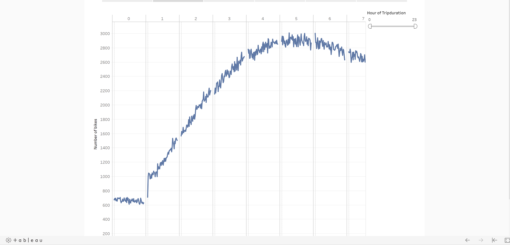
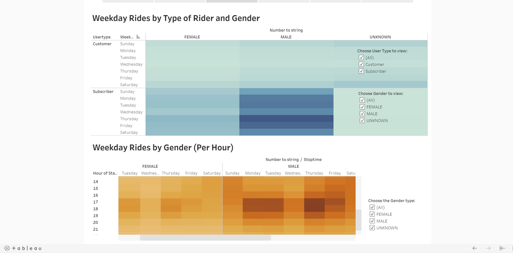
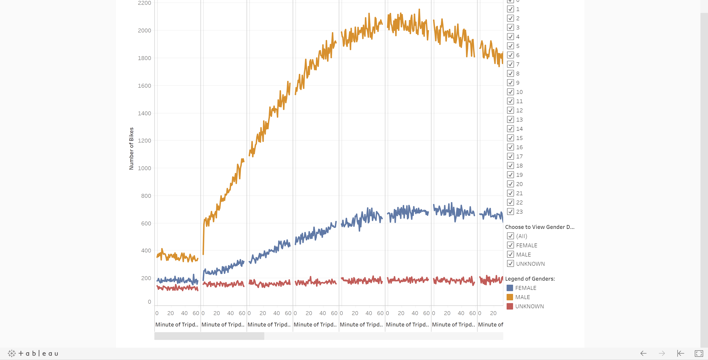
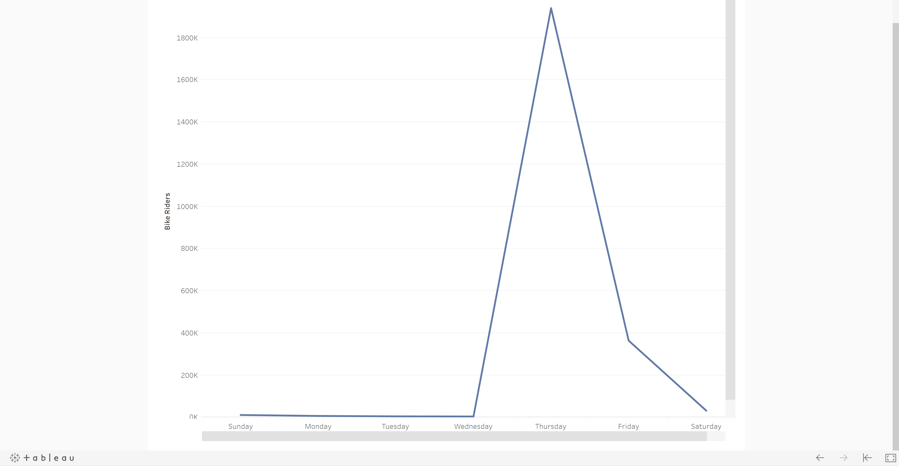
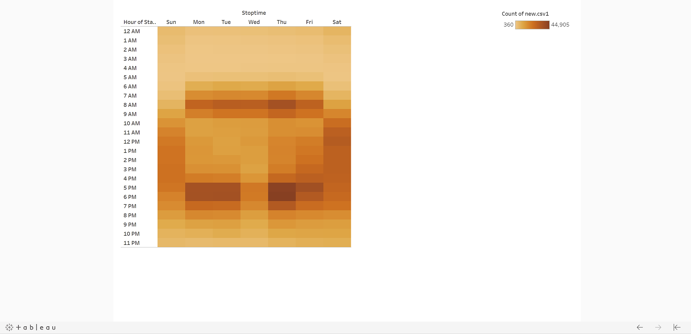
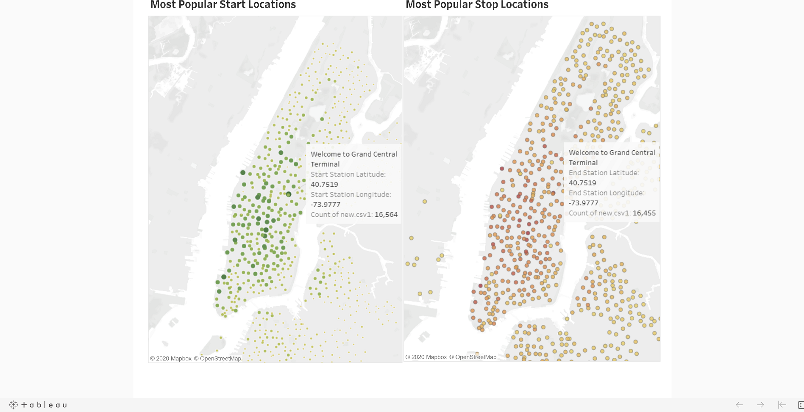

# Analysis of NYC Citi Bike Data: Will Investors Make Bikesharing in Des Moines a Reality? 
## Overview of the Analysis ##
### Purpose 

The purpose of this analysis is to provide an interested group of investors in Des Moines with data visualizations they have requested. The analysis must answer investor questions about bikesharing in NYC and provide insights for a potential bikesharing investment in Des Moines. Investors want to understand several key points about their potential investment and I will use Tableau to tell the story of the data. The source of data for the analysis will come from NYC Citi Bike data provided for public use located on the Citi Bike Website. To complete an appropriate analysis one of the data columns must be converted from a number value to an expression of time. That is, I will use a text editor, Jupyter Notebook, and Pandas for creating Python code to convert a number (integer datatype) into a useable expression of hours, mintes and seconds (datetime datatype). The purpose of changing the datatype reveals the duration of every bike ride and consistently expresses a useable datatype throughout the data. I'll be using the month of August for this analysis because of the large volume of rides. 

Using the converted datatype, I’ll create a set of visualizations to answer the following investor questions:

What is the length of time that bikes are checked out for all riders and genders?
How many bike trips, for all riders and genders, are started every hour, every day of the week?
How many bike trips are started for each type of user and gender for each day of the week?

### Results

To provide investors with actionable answers, I am providing the following visualizations and comments about the results they represent. To see the data screens in story form follow the link to my Tableau Public dashboard [link to dashboard](https://public.tableau.com/profile/peter.miller2058)

The screen above provides the total number of riders for the month of August in NYC. It is important to note there are two types of riders represented in this screen: Customers and Subscribers. Customers are those who make a reservation for a one time ride or walk-up to a bike station and rent a bike. Subscribers are those who pay a monthly or yearly subscription fee to use bikeshare services whenever they desire. The data confirms there is an overwhelming number of Subscibers participating in the August analysis. This visualization is important to future investors because a solid base of Subscribers is nessecary for long-term viability and return on investment.

The screen above provides information about the duration of bike rides. This visualization tells investors the majority of rides are between 4.5 and 6.5 hours in duration. This is important becasue of at least two factors: one, longer rides during peak hours mean fewer bikes may be available at popular stations. Secondly, Customers taking 4.5 to 6.5 hour bike rides represent higher prifit margins but also more wear on the bikes.

The screen above provides two dataset graphs visualizing weekday rides by type of rider, Subscriber and Customer, and reported gender of the rider. The second graph visualizes the weekday rides by gender for every hour. This screen is important, in my opinion, because it identifies the predominat gender driving demand for bikes. There are two high demand time periods every day: between 6:30 and 8a.m. and 5:00 and 7:00p.m. The highest demand day of the week for bike rides is Thursday, closely followed by Friday. Knowing when high demand periods occur will also help determine when repairs and re-allocation are most efficiently handled.

The screen above is another view of riders in the user base, the peak hours of rides, and the number of bikes in use every hour by rider type and gender. This visualization gives a big picture view of how all of the mentioned factors are working together to create the story of daily useage. It is important to the analysis because investors want to konw how many rides are taking place each hour and who is riding.  

The screen above visualizes which day of the week is most popular for bike rides. The screen provides the number of bike riders and the week day rides take place. This screen provides important information about demand for bikes. From previous screens it is clear that regardless of gender everyone wants their bike at the same time of the day and now it is clear which day presents the highest demand from all riders, Thursday. This is important when planning for distribution of bikes and managing peak hours of operation.

The screen above presents another vew of the high and low demand times during each day and the week days with highest and lowest denamd for bikes. This is important for investors to know when considering how many bikes to have avilable and where to have the most bikes available to meet rider's demands.

The screen above visualizes the most popular stations for starting and ending a bike ride in NYC. During the month of August the start and stop points are the same, Grand Central Terminal. This screen is important for investors when trying to understand useage patterns and traffic patterns of riders. Investors want to know where their clients are going, what is at the location and how long it takes to complete a ride. 

## Summary
In summary, there was a total of 2,344,224 bike rides in August. From the data results we know that 1,900,359 users are Subscribers and there were 443,865 Customers riding. There is a peak number of riders who rent a bike for 5 to 6 hours, the largest number being male. Thursdays hold a slight preference over Fridays for highest demand of bikes. There are two peak periods every week day that align with traditional business hours beginning and ending (around 8a.m. and 5p.m.) and at the same location, Grand Central Terminal. There seems to be no correlation to gender demands for bikes during peak hours: everyone wants a bike to ride at the same time. 

### Thinking About the Future
What additional information is needed for Des Moines' investors to make an informed decision? Here are two suggestions I have for future bikesharing in Des Moines: 

1.) Can Des Moines' current street infrastructure handle the additional traffic of bikesharing? That is, are the streets wide enough for bikes and other vehicles to co-exist? Are streets level and in good repair?  I would suggest a visualization of NYC streets (and obviously Des Moines street infrastructure as well) to understand how street location and capacity determine the routes bike riders take for a safe and efficient ride; assuming those two are relateable in NYC while riding a bike. Which also brings up another issue, are there areas designated "off limits" for bike riders in NYC? Are there areas that have been developed especially for bike riders to commute?  

2.) Are there adequate staging areas already available for large numbers of bikes in high demand locations? Will existing land need to be purchased and transformed into bikeshare stations? Is it affordable to purchase and build said stations? I suggest exploring similar companys and industry doing business along high occupancy bike traffic routes in NYC to see if there are any comparisons that would help Des Moines look deeper into high demand traffic routes and predicting bike routes based on types of companies and popular destinations. An additional visualization would include popular bike routes that handle the greatest number of riders every day in NYC. Include several points along the route with the most starting/ending stations filtered by gender.

this concludes my analysis PEM
