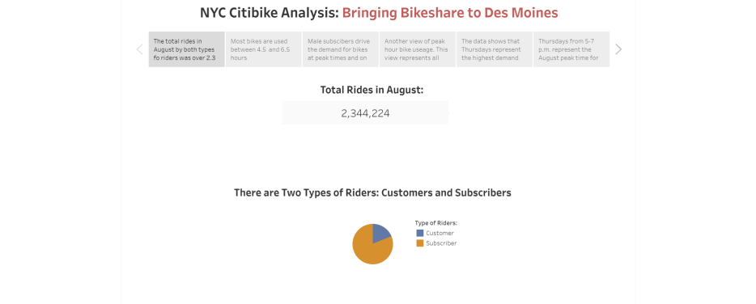
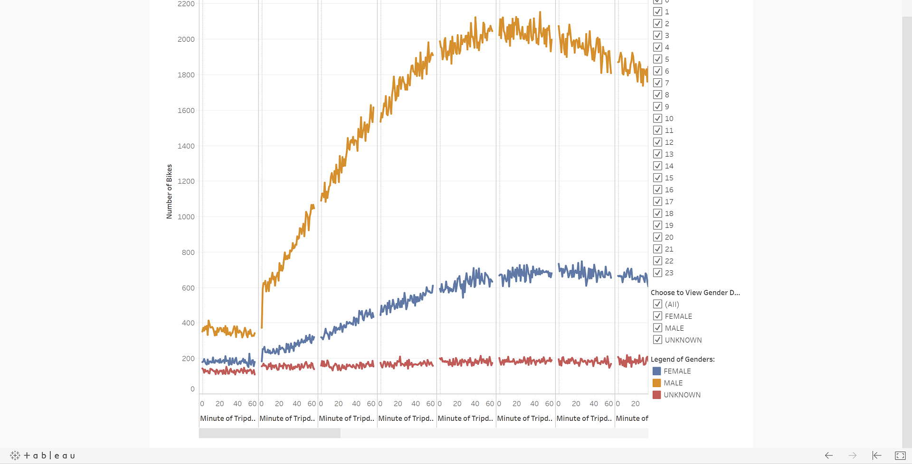
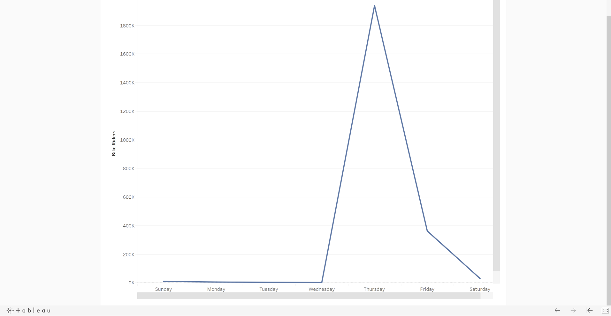

# Analysis of NYC Citi Bike Data: Will Investors Make Bikesharing in Des Moines a Reality? 
## Overview of the Analysis ##
### Purpose 

The purpose of this analysis is to provide an interested group of investors in Des Moines with data visualizations they have requested. The analysis must answer investor questions about bikesharing in NYC and provide insights for a potential bikesharing investment in Des Moines. Investors want to understand several key points about their potential investment and I will use Tableau to tell the story of the data. The source of data for the analysis will come from NYC Citi Bike data provided for public use located on the Citi Bike Website. To complete an appropriate analysis one of the data columns must be converted from a number value to an expression of time. That is, I will use a text editor, Jupyter Notebook, and Pandas for creating Python code to convert a number (integer datatype) into a useable expression of hours, mintes and seconds (datetime datatype). The purpose of changing the datatype reveals the duration of every bike ride and consistently expresses a useable datatype throughout the data. I'll be using the month of August for this analysis because of the large volume of rides. 

Using the converted datatype, I’ll create a set of visualizations to answer the following investor questions:

What is the length of time that bikes are checked out for all riders and genders?
How many bike trips, for all riders and genders, are started every hour, every day of the week?
How many bike trips are started for each type of user and gender for each day of the week?

### Results

To provide investors with actionable answers to their questions, I am providing the following visualizations and expinations below of the reuslts they represent.

The screen above provides the total number of riders for the month of August. It is important to note there are two types of riders represented in this screen: Customers and Subscribers. Customers are those who make a reservation for a one time ride or walk-up to a bike station and rent a bike. Subscribers are those who pay a monthly or yearly subscription fee to use bikeshare services whenever they desire. The data confirms there is an overwhelming number of Subscibers participating in the August analysis. This visualization is important to future investors because a solid base of Subscribers is nessecary for long-term viability and return on investment.

The screen above provides information about the duration of bike rides. This visualization tells investors the majority of rides are between 4.5 and 6.5 hours in duration. This is important becasue of at least two factors: one, longer rides during peak hours mean fewer bikes are available. Secondly, Customers taking 4.5 to 6.5 hour bike rides represent higher prifit margins but also more wear on the bikes.

The screen above provides two dataset graphs visualizing weekday rides by type of rider, Subscriber and Customer, and reported gender. The seond grapf visualizes the weekday rides by gender for every hour. this screen is important, in my opinion, because it identifies the predominat gender driving denand for bikes. There are two high demand time periods every day: between 6:30 and 8a.m. and 5:00 and 7:00p.m. The highest demand day of the week for bike rides is Thudsday, closely followed by Friday. Knowing when high demand periods are will also help determine when repairs and allocation are most efficiently handled.

the There are at least seven visualizations for the NYC Citibike analysis (7 pt)
There is a description of the results for each visualization (7 pt)
Summary:

There is a high-level summary of the results and two additional visualizations are suggested for future analysis (5 pt)
